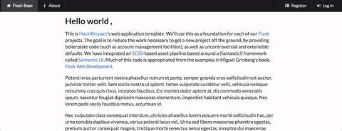
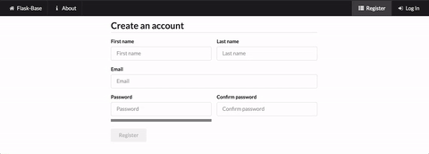
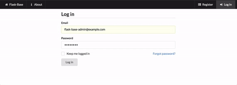
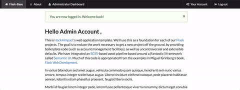
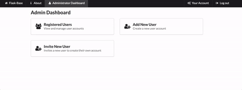

# flask-base [](https://circleci.com/gh/hack4impact/flask-base) [](https://waffle.io/hack4impact/flask-base) [] (https://codeclimate.com/github/hack4impact/flask-base/coverage) [](https://codeclimate.com/github/hack4impact/flask-base)


A Flask application template with the boilerplate code already done for you. 


**Documentation available at [http://hack4impact.github.io/flask-base](http://hack4impact.github.io/flask-base).**

## What's included?

* Blueprints
* User and permissions management
* Flask-SQLAlchemy for databases
* Flask-WTF for forms
* Flask-Assets for asset management and SCSS compilation
* Flask-Mail for sending emails
* gzip compression
* Redis Queue for handling asynchronous tasks
* ZXCVBN password strength checker  
* CKEditor for editing pages

## Demos

Home Page:

 

Registering User:



Admin Homepage:



Admin Editing Page:

 

Admin Editing Users:


Admin Adding a User: 



## Setting up

##### Clone the repo

```
$ git clone https://github.com/hack4impact/flask-base.git
$ cd flask-base
```

##### Initialize a virtualenv

```
$ pip install virtualenv
$ virtualenv env
$ source env/bin/activate
```

##### (If you're on a mac) Make sure xcode tools are installed

```
$ xcode-select --install
```

##### Add Environment Variables 

Create a file called `.env` that contains environment variables in the following syntax: `ENVIRONMENT_VARIABLE=value`. For example,
the mailing environment variables can be set as the following. We recommend using Sendgrid for a mailing SMTP server. But anything else will work as well.
```
MAIL_USERNAME=SendgridUsername
MAIL_PASSWORD=SendgridPassword
SECRET_KEY=SuperRandomStringToBeUsedForEncryption
```
**Note: do not include the `.env` file in any commits. This should remain private.**

##### Install the dependencies

```
$ pip install -r requirements/common.txt
$ pip install -r requirements/dev.txt
```

##### Other dependencies for running locally

You need to install [Foreman](https://ddollar.github.io/foreman/) and [Redis](http://redis.io/). Chances are, these commands will work:

```
$ gem install foreman
```

Mac (using [homebrew](http://brew.sh/)):

```
$ brew install redis
```

Linux:

```
$ sudo apt-get install redis-server
```

##### Create the database

```
$ python manage.py recreate_db
```

##### Other setup (e.g. creating roles in database)

```
$ python manage.py setup_dev
```

Note that this will create an admin user with email and password specified by the `ADMIN_EMAIL` and `ADMIN_PASSWORD` config variables. If not specified, they are both `flask-base-admin@example.com` and `password` respectively.

##### [Optional] Add fake data to the database

```
$ python manage.py add_fake_data
```

## Running the app

```
$ source env/bin/activate
$ foreman start -f Local
```

## Formatting code

Before you submit changes to flask-base, you may want to auto format your code with `python manage.py format`.


## Contributing

Contributions are welcome! Check out our [Waffle board](https://waffle.io/hack4impact/flask-base) which automatically syncs with this project's GitHub issues. Please refer to our [Code of Conduct](./CONDUCT.md) for more information.

## Documentation Changes

To make changes to the documentation refer to the [Mkdocs documentation](http://www.mkdocs.org/#installation) for setup. 

To create a new documentation page, add a file to the `docs/` directory and edit `mkdocs.yml` to reference the file. 

When the new files are merged into `master` and pushed to github. Run `mkdocs gh-deploy` to update the online documentation.

## License
[MIT License](LICENSE.md)
